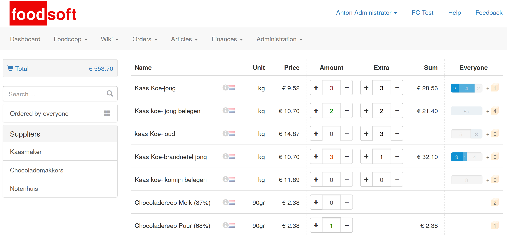

Foodsoft Webshop
================

This is an EXPERIMENTAL webshop component for [Foodsoft](https://github.com/foodcoops/foodsoft).

Based on [React](http://facebook.github.io/react/) and [redux-api](https://github.com/lexich/redux-api),
it may replace the existing [rails](http://www.rubyonrails.org/)-based webshop component at some point.

It functions together with Foodsoft's future API from
[this branch](https://github.com/wvengen/foodsoft/tree/feature/rest-for-shop), which is very much a
work-in-progress as well.

The hope is that this brings [foodcoop-adam/foodsoft#163](https://github.com/foodcoop-adam/foodsoft/issues/163)'s
_Revamped member ordering pages_ to the main Foodsoft repository in a clean way.

